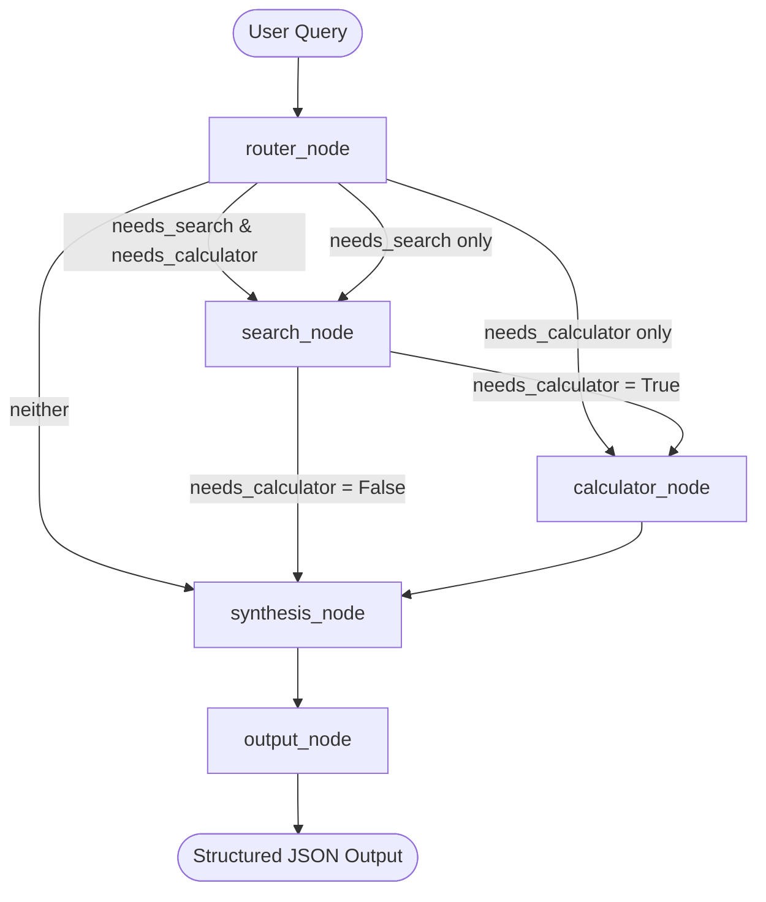

# FinSense AI Backend

> [!TIP]
> 🌐 **Live Production Link**: [https://finsense-ai-1.onrender.com](https://finsense-ai-1.onrender.com)

FinSense AI is an India-specific personal finance agent backend built with LangGraph, FastAPI, Groq LLM (`llama-3.3-70b-versatile`), and Tavily Web Search. It helps users answer complex personal finance questions, perform calculations (EMI, SIP, Tax, Fixed Deposits), and get structured financial summaries with domain-restricted information and full source citations.

---


## Features
- **Multi-step Agentic Workflows**: Orchestrated using LangGraph state graphs.
- **Smart Query Routing**: Dynamically classifies query types and routes requests to appropriate search or calculation tools.
- **Custom Indian Financial Calculators**:
  - **EMI**: Compound interest loan EMI calculations.
  - **SIP**: System Investment Plan returns projection.
  - **Tax Slabs**: Math calculations adhering to budget 2025-26 slabs under New & Old regimes, including standard deductions and Section 87A rebate rules.
  - **Fixed Deposits (FD)**: Compound interest calculations with quarterly, monthly, or annual compounding.
- **Groq Synthesis**: Synthesis using `llama-3.3-70b-versatile` with automatic rate-limit (429) fallback to `llama-3.1-8b-instant`.
- **FastAPI Endpoints**: Fully validated inputs and error-contained outputs with CORS enabled.

---

## Architecture Diagram

The multi-node agent workflow is structured as follows:



---

## Installation & Setup

### Prerequisites
- Python 3.11+
- Pip (Python Package Manager)

### Steps
1. **Clone/Navigate to project directory**:
   ```bash
   cd "c:/Users/desai/OneDrive/Desktop/FinSense AI"
   ```

2. **Install dependencies**:
   ```bash
   pip install -r requirements.txt
   ```

3. **Configure Environment Variables**:
   Create a `.env` file (copied from `.env.example`) and add your API keys:
   ```env
   GROQ_API_KEY=gsk_your_key_here
   TAVILY_API_KEY=tvly-your_key_here
   ```

4. **Run FastAPI Application**:
   ```bash
   uvicorn app.main:app --reload
   ```
   The backend server will start running on `http://127.0.0.1:8000`.

---

## API Documentation

### 1. Health Status
Check system health and the underlying primary model.
- **Endpoint**: `GET /api/health`
- **Response**:
  ```json
  {
    "status": "ok",
    "model": "llama-3.3-70b-versatile"
  }
  ```

### 2. Query FinSense AI
Submit a personal finance query.
- **Endpoint**: `POST /api/query`
- **Request Body**:
  ```json
  {
    "query": "Calculate EMI for a 50 lakh home loan at 8.5% for 20 years"
  }
  ```
- **Response Body**:
  ```json
  {
    "answer": "Your home loan EMI calculation is ready...",
    "recommendation": "Review parameters and consult a SEBI-registered professional.",
    "key_points": [
      "Principal: ₹50 Lakhs",
      "Tenure: 20 Years",
      "Monthly EMI: ₹43,391"
    ],
    "sources": [
      {
        "title": "Home Loan EMI Calculator",
        "url": "https://www.bankbazaar.com/home-loan-emi-calculator.html"
      }
    ],
    "tools_used": ["finance_calculator"],
    "calculations": {
      "monthly_emi": 43391.14,
      "total_payment": 10413873.6,
      "total_interest": 5413873.6,
      "principal": 5000000.0
    },
    "disclaimer": "This is for informational purposes only and does not constitute financial advice. Please consult a SEBI-registered financial advisor before making investment decisions.",
    "last_updated": "2025-26"
  }
  ```

---

## Sample Queries
- *Rates & Comparative Search*: `"Compare SBI vs HDFC vs ICICI FD rates for 1 year"`
- *Tax Slabs*: `"I earn 10 LPA, what is my tax under new regime 2025-26?"`
- *ELSS vs PPF Comparison*: `"Should I invest in PPF or ELSS for 80C benefit?"`
- *RBI Repo rate & EMI*: `"What is the current RBI repo rate and how does it affect my home loan EMI?"`

---

## Verification and Testing
To run the automated test suite, execute the following command:
```bash
python -m pytest
```

### Test Results Summary
| Test File | Test Case | Target Checked | Status |
|---|---|---|---|
| `test_tools.py` | `test_calculate_emi` | Mathematical EMI accuracy | Passing |
| `test_tools.py` | `test_calculate_sip` | Maturity SIP growth validation | Passing |
| `test_tools.py` | `test_calculate_tax` | Budget 2025-26 slabs & standard deduction | Passing |
| `test_tools.py` | `test_calculate_fd` | FD quarterly compound calculation | Passing |
| `test_tools.py` | `test_format_response` | Structured JSON mapping consistency | Passing |
| `test_agent.py` | `test_router_node_search_only` | Router search detection keywords | Passing |
| `test_agent.py` | `test_router_node_calculator_only` | Router calculator detection keywords | Passing |
| `test_agent.py` | `test_router_node_both` | Router multi-tool execution pathing | Passing |
| `test_agent.py` | `test_full_agent_flow` | End-to-end node traversal with mock endpoints | Passing |
